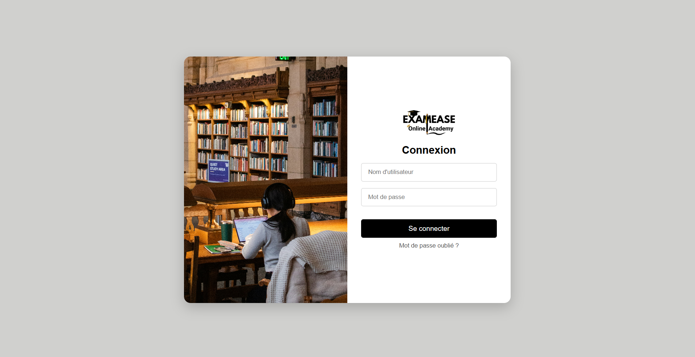

## ExamEase - Gestion des examens universitaires

> Une plateforme web pour gérer les examens, utilisateurs (étudiants/enseignants/admins), notifications, notes et quiz.

#### Cloner le projet

```bash
git clone <URL_DU_REPO>

cd
.
├── backend/       --> API Spring Boot
└── frontend/      --> Interface React (Vite)

```

---

## 🖥️ Frontend – React.js

### 🔧 Prérequis

- [Node.js](https://nodejs.org/) (v16+ recommandé)
- [npm](https://www.npmjs.com/) ou [Yarn](https://yarnpkg.com/)

### 🚀 Lancer le projet

```bash
cd frontend
npm install      # ou yarn install
npm start     # ou yarn dev
```

### 🌐 Accès

> Accéder à l'application via : `http://localhost:3000`

### 📁 Arborescence utile

```
frontend/
├── src/
│   ├── assets/                # Images, logos
│   ├── components/            # Composants UI
│   ├── context/               # Contexte Auth & Notifications
│   ├── pages/                 # Pages principales (Dashboard, Login, etc.)
│   ├── services/              # Appels API (users, exams, courses, etc.)
│   ├── App.jsx                # Point d'entrée principal
│   └── main.jsx               # Bootstrap React app
```

### 📦 Librairies principales

- `react-router-dom` (navigation)
- `axios` (requêtes HTTP)
- `recharts` (graphique résultats)
- `heroicons` (icônes modernes)
- `sass` (styles SCSS personnalisés)

---

## ⚙️ Backend – Spring Boot (Java)

### 🔧 Prérequis

- Java 17
- Maven
- PostgreSQL (ou H2 pour dev rapide)

### ⚙️ Configuration

Configurer le fichier `application.properties` (ou `application.yml`) :

```properties
spring:
  application:
    name: backend
  datasource:
    url: jdbc:postgresql://localhost:5432/examease
    username: postgres
    password: admin
    driver-class-name: org.postgresql.Driver
  jpa:
    database-platform: org.hibernate.dialect.PostgreSQLDialect
    hibernate:
      ddl-auto: update
    show-sql: true
  sql:
    init:
      mode: always
      continue-on-error: false
```

### ▶️ Lancer le backend

```bash
cd backend
./mvnw spring-boot:run
```

> L’API sera disponible via : `http://localhost:8080`

### 📁 Structure backend

```
backend/
├── controller/               # Contrôleurs REST
├── entity/                   # Entités JPA (User, Exam, Promotion, etc.)
├── repository/               # Interfaces JPA
├── service/                  # Logique métier
├── security/                 # JWT, auth manager, filters
└── util/                     # Utils (JwtUtil, etc.)
```

---

## 🔐 Authentification

- JWT basé sur Spring Security
- Rôles : `ADMIN`, `TEACHER`, `STUDENT`
- Chaque utilisateur reçoit un token après login

---

## ✅ Fonctionnalités principales

- Gestion des utilisateurs (CRUD)
- Création / affichage des examens
- Génération d’examens à partir de templates
- Notifications en temps réel (prof → admin / étudiant)
- Résultats et graphiques
- Interface adaptée au rôle (admin, prof, étudiant)

---

## 📸 Aperçu




---

## 🧑‍💻 Contributeurs

- Rizlène
- Abir
- Marc
